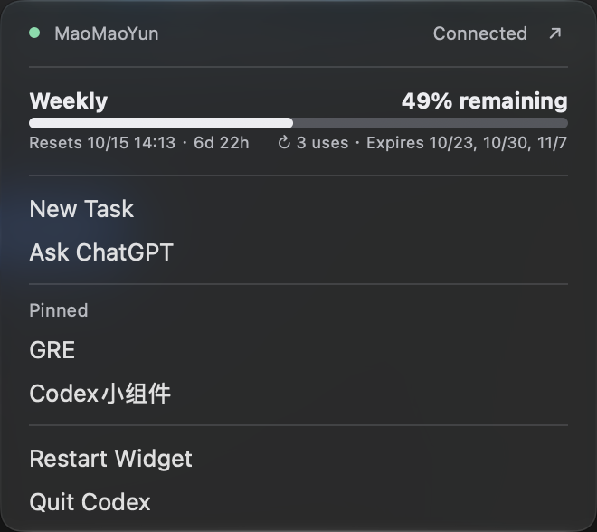

# Codex Usage Meter

**把 Codex 剩余额度放进 macOS 菜单栏。**

A lightweight, native macOS menu bar app for Codex usage limits and pinned chats.

Codex Usage Meter 用一个额度圆环显示大致余量，点击后查看完整额度、重置时间和固定聊天。不需要一直打开 Codex 的用量页面，也不需要调用模型来维持监控。

> 非官方个人项目，与 OpenAI 无隶属关系。目前以本机使用为主，尚未经过 Developer ID 签名、公证或广泛的跨版本兼容测试。

## 界面预览

<p align="center">
  
</p>

实际运行截图，裁剪自桌面截图。此例中接口仅返回 Weekly 额度；返回 5 小时额度时也会显示 Session。

## 主要功能

| 功能 | 行为 |
| --- | --- |
| 额度圆环 | 优先显示 Session，未返回 Session 时显示 Weekly；剩余 ≤20% 为橙色、≤5% 为红色。 |
| 动态额度卡片 | 按接口返回的窗口时长识别 Session / Weekly，没有返回的窗口不显示，不根据套餐名称猜测。 |
| 重置提示 | 展示实际重置时间、倒计时，以及接口返回的重置券数量与到期时间；不会自动使用重置券。 |
| 运行提示 | 中心图标变绿表示检测到近期任务执行记录；这是本地记录推断，并非官方实时心跳。 |
| 固定聊天 | 在 Pinned 中显示本机 Codex 的固定聊天名称，点击回到原聊天。 |
| 快捷操作 | New Task、Ask ChatGPT、Restart Widget 和 Quit Codex。Ask ChatGPT 只打开网页。 |
| MaoMaoYun 集成 | 连接状态、VPN 开关和打开应用入口；包含启动自动连接及系统唤醒后断开再连接。 |
| 独立 App | 双击启动、单实例保护、组件内部重启和登录自启动；不占 Dock。 |
| 容错与缓存 | 后台刷新；失败保留上次有效值并标记 stale，缓存按账号隔离。 |

界面使用原生 **NSMenu / AppKit**，保留系统菜单的点击、悬停和点击外部关闭行为。

## 使用前了解

- 需要 macOS，以及已安装、已登录的 Codex。额度读取优先使用桌面应用内置 CLI，也支持代码中列出的独立 CLI 安装位置。
- 完整的 Pinned 和任务运行提示依赖本机 Codex 数据库；仅安装 CLI 不等于具备桌面端的全部数据。
- MaoMaoYun 功能是针对名为 `MaoMaoYun` 的系统 VPN 服务实现的，不是通用 VPN 插件。**启动及唤醒可能改变该 VPN 的连接状态。**
- 运行 App 不需要 Node.js；从源码验证、构建和安装需要 Node.js 与 Xcode Command Line Tools。
- 当前读取脚本使用 `/usr/bin/jq`、`/usr/bin/sqlite3` 等系统工具。原生启动器包含 arm64 / x86_64，但不代表所有 macOS 版本、Intel 设备均已验证。
- 没有独立的登录系统：继续使用本机 Codex 的登录状态，不要求在小组件里填写 API Key。

## 从源码开始

先安装上述开发依赖，然后：

```sh
git clone https://github.com/WENTAO2297/CodexUsageMeter.git
cd CodexUsageMeter
zsh verify.sh
```

### 构建 App

```sh
zsh build.sh
```

命令会打印构建好的 `.app` 路径。双击即可启动，无需额外运行看守脚本。也可以传入一个尚不存在的目标路径：

```sh
zsh build.sh "/path/to/Codex Usage Meter.app"
```

### 安装并登录自启动

```sh
zsh install-autostart.command
```

安装器会先验证、构建，再切换运行版本：

- App：`~/Applications/Codex Usage Meter.app`
- 缓存、日志及回滚：`~/Library/Application Support/CodexUsageMeter`
- 登录启动：`~/Library/LaunchAgents/com.wentao.codex-usage-meter-watch.plist`

上一版保存在 `Rollback`，安装失败会尝试恢复旧版本。安装过程会重启小组件，不停止 Codex 的任务。

### 卸载

```sh
zsh uninstall-autostart.command
```

**这会停止小组件并删除 App、自启动配置、本地缓存、日志及回滚副本。** 不删除项目源码或 Codex 聊天、工作文件。

## 数据与隐私

- 小组件通过本机 Codex CLI 的 `account/rateLimits/read` 读取额度，不发送模型提示来轮询；CLI 可能需要联网获取账号额度。
- 任务状态和固定聊天通过只读 SQLite 查询获取，不修改 Codex 数据库，也不控制任务停止或续跑。
- 为隔离缓存，会读取本地认证文件中的账号标识；小组件自己的缓存不保存 token 或 API Key。
- 额度缓存保存账号标识、窗口余量、重置时间及重置券信息；目录权限为 `0700`，文件权限为 `0600`。
- 无有效数据时明确显示同步失败；已有数据过期或刷新失败时保留旧值并标记 `stale`。
- 提交 issue 时请勿附带认证文件、完整数据库或未经检查的日志、截图。

## 已知限制

- 数据库文件名、表结构、CLI 协议与桌面深链接可能随 Codex 更新变化，兼容性需要持续维护。
- 运行提示依据最近执行记录推断；长时间不写记录的任务可能显示为空闲。
- 当前为本地 ad-hoc 签名，尚未公证；这不是已完成跨设备分发验证的正式发行包。
- GitHub 仓库展示的是源码和说明，暂不附带旧版二进制或个人开发历史。
- 当前仓库尚未指定开源许可证。

## 开发与验证

核心界面与业务采用 JXA / AppKit，外层使用轻量 Cocoa 启动器管理生命周期。模块划分、刷新频率、诊断与测试见 [开发说明](docs/DEVELOPMENT.md)。

```sh
# 回归检查：额度、账号缓存、VPN 逻辑、原生菜单和读取器
zsh verify.sh

# 额外读取当前账号的实际额度与本地数据库
zsh verify.sh --live

# 校验构建包
node Tests/app-bundle.cjs "/path/to/Codex Usage Meter.app"

# 安装后的生命周期测试：会短暂重启小组件
node Tests/app-lifecycle.cjs --installed
```
